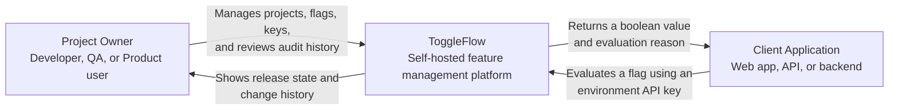
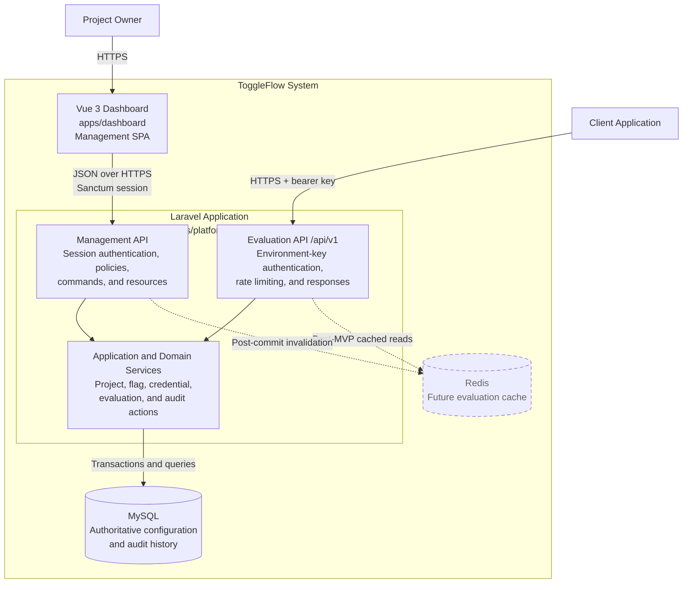
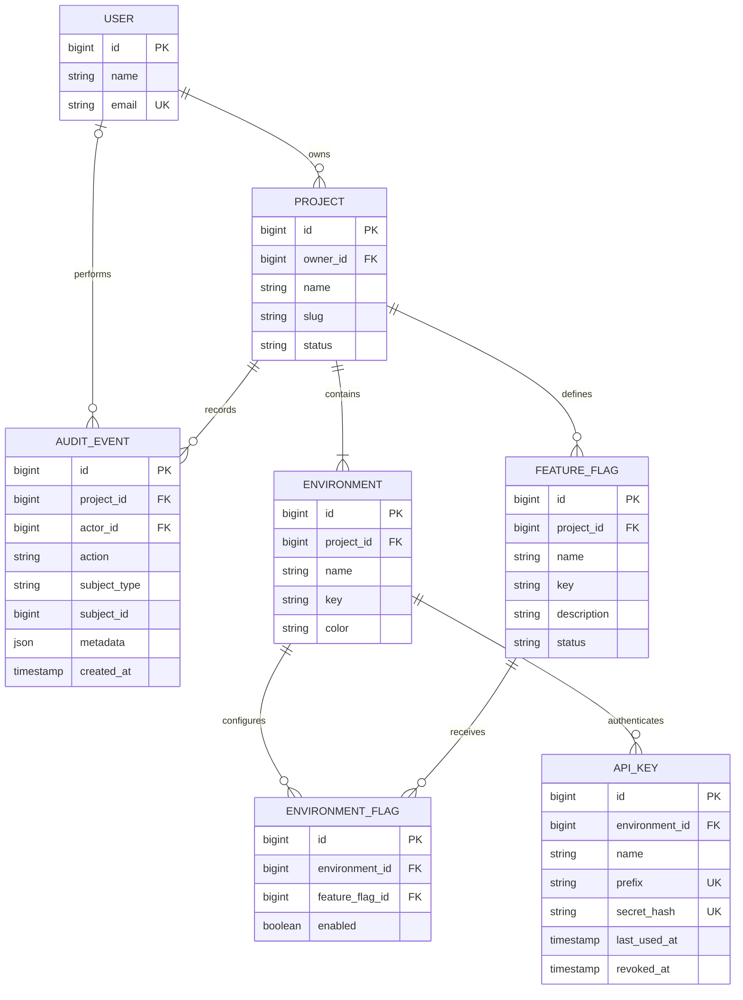
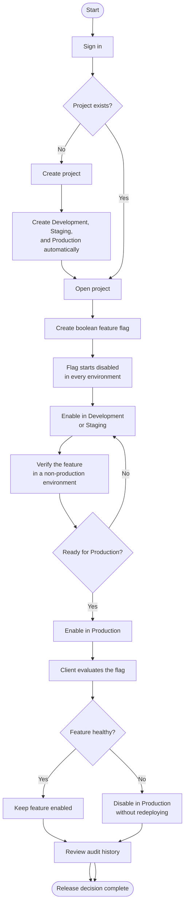
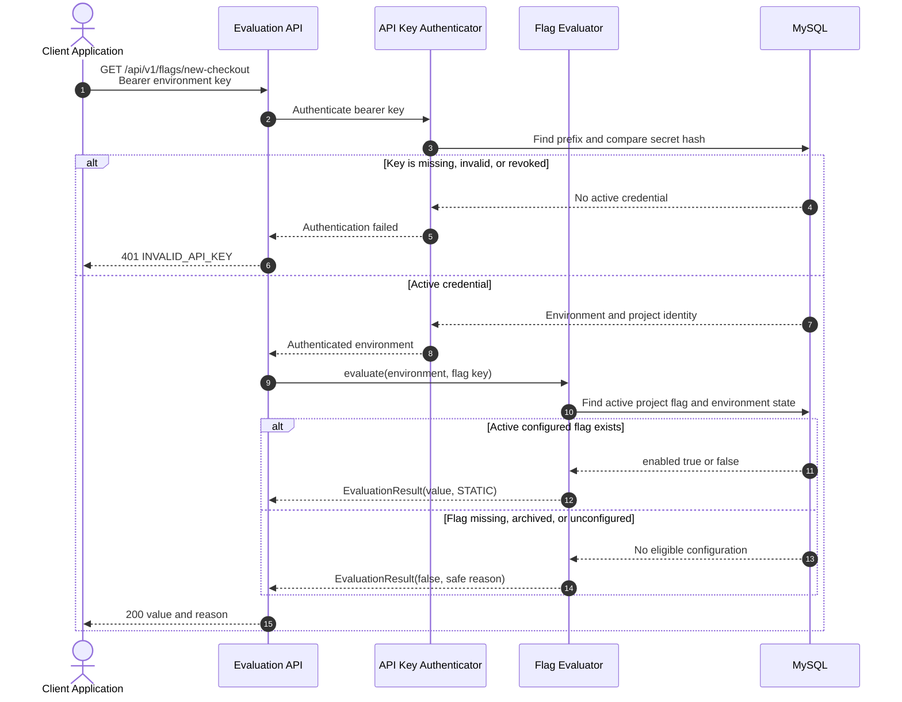
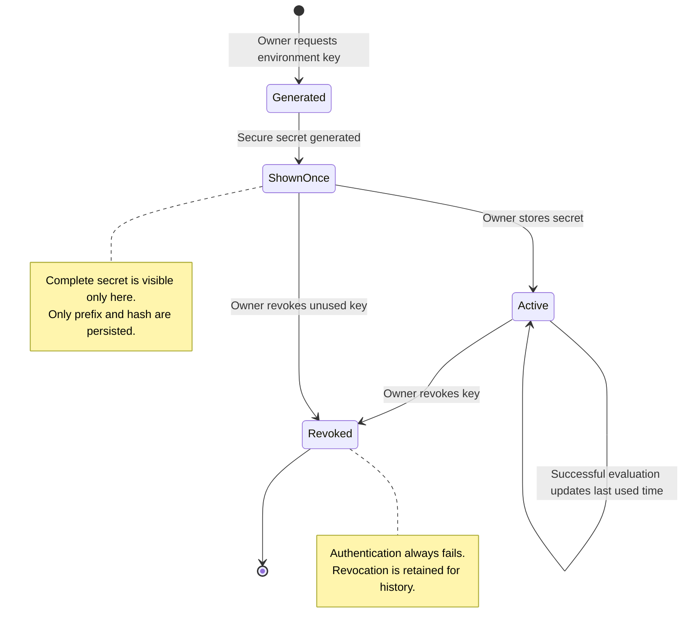
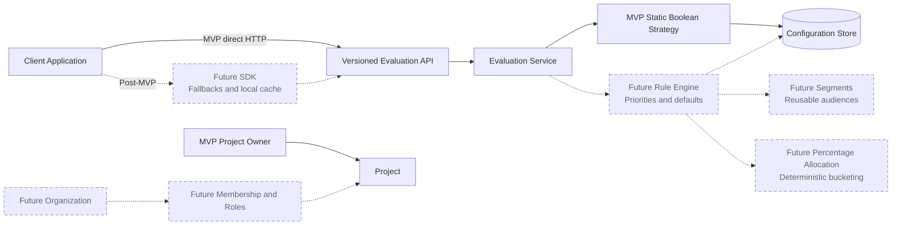

# Architecture and Flow Diagrams

## 1. Purpose and Scope

These diagrams visualize the MVP 0.1 architecture and primary workflows defined in
the product requirements, domain architecture, and API contract. Solid components are
part of the MVP. Dashed or explicitly labeled future components show intended
extension points and are not implementation commitments for MVP 0.1.

## 2. Diagram Index

| Diagram | Question answered |
| --- | --- |
| System Context | Who uses ToggleFlow, and why? |
| Container View | Which runtime components own management and evaluation behavior? |
| Domain Model | How are users, projects, environments, flags, keys, and audit events related? |
| Primary Management Flow | How does an owner configure and release a feature? |
| Evaluation Sequence | How does a client application obtain a safe boolean value? |
| Flag State Change Sequence | How are state and audit history kept consistent? |
| API Key Lifecycle | How does an environment credential move from creation to revocation? |
| Evolution View | Where do post-MVP capabilities extend the system? |

## 3. C4 Level 1 — System Context

The system context separates human feature management from runtime evaluation. The
project owner controls release configuration; the client application consumes it.



### Context boundary

- The project owner is authenticated through the management session.
- The client application is authenticated using a credential scoped to one
  environment.
- ToggleFlow does not execute the consuming application's feature. It returns the
  decision the application uses.
- Third-party identity, notifications, analytics, and billing are outside MVP 0.1.

## 4. C4 Level 2 — Container View

The MVP is one monorepo with an independently built Vue dashboard and a modular
Laravel backend connected to one authoritative database. Management and evaluation
use different entry paths even though both backend paths share domain services and
persistence. The diagram shows runtime containers, not separate repositories.



### Container responsibilities

| Container | Responsibility |
| --- | --- |
| Vue dashboard | Present projects, flag state, credentials, and recent changes. |
| Management API | Validate owner commands and enforce project authorization. |
| Evaluation API | Authenticate environment keys and return stable evaluation responses. |
| Domain services | Enforce invariants and coordinate state changes with audit events. |
| MySQL | Store authoritative configuration, credential hashes, and audit history. |
| Redis | Optional post-MVP acceleration; never the sole source of configuration. |

For self-hosting, a reverse proxy should normally expose the dashboard and Laravel
routes through one HTTPS origin. Local development may use separate Vite and Artisan
origins with credentialed CORS and Sanctum stateful-domain configuration.

## 5. Core Domain Model

The environment-specific state is modeled separately from the flag definition. This
allows the same flag to be disabled in Production and enabled in Development without
duplicating flag metadata.



### Important constraints

- A project slug is unique for its owner in MVP 0.1.
- An environment key and feature-flag key are unique within their project.
- The pair of environment and feature flag is unique in `ENVIRONMENT_FLAG`.
- An API key stores a lookup prefix and secure secret hash, never the recoverable
  secret.
- Audit metadata is allowlisted and cannot contain complete credentials.

## 6. Primary Project-owner Flow

This user flow represents the portfolio demonstration and the smallest complete
product loop.



## 7. Runtime Evaluation Sequence

The API key determines the environment. A caller cannot request a different project
or environment in request data.



### Failure behavior

- Authentication failures use `401` and do not reveal whether the requested flag
  exists.
- Missing or unavailable flags return the safe boolean `false` and a reason in MVP
  0.1.
- The consuming application must retain a local fallback for network and server
  failures.

## 8. Flag State Change and Audit Sequence

The configuration change and audit event share one database transaction. This avoids
showing a new state without its history or a history entry for a change that failed.

```mermaid
sequenceDiagram
    autonumber
    actor Owner as Project Owner
    participant UI as Vue Dashboard
    participant API as Management API
    participant Policy as Project Policy
    participant Action as SetEnvironmentFlagState
    participant Recorder as RecordAuditEvent
    participant DB as MySQL

    Owner->>UI: Enable new-checkout in Production
    UI->>API: Submit state-change command
    API->>Policy: Authorize owner and project

    alt Owner is unauthorized
        Policy-->>API: Denied
        API-->>UI: 403 Forbidden
        UI-->>Owner: Show failure; retain prior state
    else Owner is authorized
        Policy-->>API: Allowed
        API->>Action: Set enabled = true
        Action->>DB: Begin transaction
        Action->>DB: Update environment flag
        Action->>Recorder: record(flag, actor, FeatureFlagEnabled, metadata)
        Recorder->>DB: Append feature_flag.enabled event

        alt Any write fails
            Action->>DB: Roll back transaction
            Action-->>API: Change failed
            API-->>UI: Error response
            UI-->>Owner: Show failure; retain prior state
        else Both writes succeed
            Action->>DB: Commit transaction
            Action-->>API: Updated state
            API-->>UI: Success response
            UI-->>Owner: Show Production enabled
        end
    end
```

`FeatureFlag` implements `Auditable` and uses `HasAuditEvents`; the same convention
applies to every Eloquent model that can be an audit subject. `AuditEvent.action` is
cast to the shared `AuditEventAction` enum. `RecordAuditEvent` centralizes
persistence, but the application action owns the transaction so the state change and
event remain visibly atomic.

## 9. Environment API Key Lifecycle



Key rotation uses two credentials temporarily: issue a replacement, deploy it to the
client application, verify successful evaluation, and then revoke the old key.

## 10. Post-MVP Evolution View

The MVP evaluator remains the entry point as capabilities grow. Future components
extend the decision process or ownership model without changing the meaning of a
project, environment, or flag key.



### Extension rules

- Preserve the `/api/v1` response contract or introduce a documented new version.
- Keep percentage allocation deterministic for the same flag, environment, and
  targeting key.
- Migrate existing owners into organizations before replacing ownership policies with
  membership permissions.
- Add Redis only as a cache with explicit post-commit invalidation.
- Keep evaluation telemetry separate from the append-only management audit log.

## 11. Related Documentation

- [MVP Product Requirements](06-mvp-product-requirements.md)
- [Domain and Architecture](07-domain-and-architecture.md)
- [API Contract](08-api-contract.md)
- [One-week Delivery Plan](09-delivery-plan.md)
- [Authentication and API Key Decision](11-authentication-and-api-key-decision.md)
- [Frontend Architecture and Design System](12-frontend-architecture-and-design-system.md)
- [Roadmap](roadmap.md)
