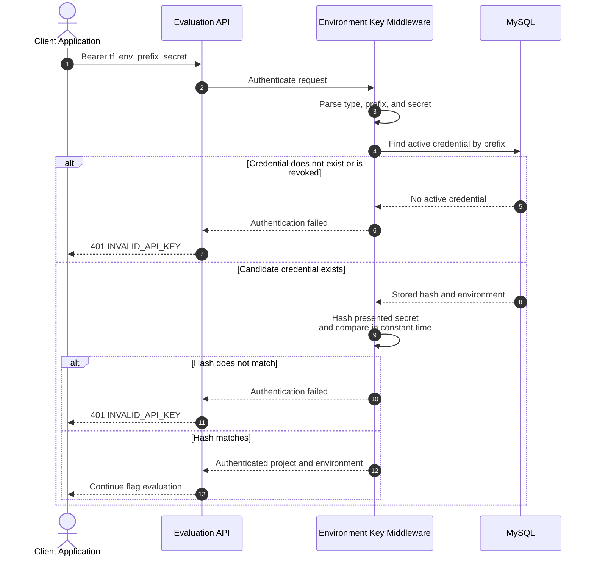

# Authentication and API Key Decision

## Status

Accepted for MVP 0.1.

## Decision

ToggleFlow uses two authentication mechanisms for two different actors:

| Actor and path | Authentication | Authorization boundary |
| --- | --- | --- |
| Human using the Vue dashboard | Laravel Sanctum session authentication | Projects owned by the authenticated user |
| Client application evaluating flags | Opaque environment API key | Read-only evaluation for exactly one environment |

Laravel Passport, OAuth 2.0 client credentials, and JWTs are not used for MVP flag
evaluation.

## Context

ToggleFlow has separate management and evaluation paths:

1. A human signs in to manage projects, environments, feature flags, and credentials.
2. An application evaluates flags at runtime for one deployment environment.

The evaluation API has a narrow authorization rule:

> A valid credential may evaluate flags for exactly the project and environment to
> which that credential was issued.

The consuming application does not act on behalf of a user, request management
permissions, or choose an environment in request data.

## Dashboard Authentication

The first-party Vue dashboard uses Laravel Sanctum's SPA authentication flow.

```text
Project owner
  → signs in to ToggleFlow
    → receives an authenticated session
      → accesses authorized management endpoints
```

Laravel policies scope every management request through projects owned by the
authenticated user. When organizations are introduced, these policies can evolve to
membership and role checks without changing evaluation credentials.

### Dashboard and API origins

Separating `apps/dashboard` from `apps/platform-api` does not change the selected
Sanctum session model.

- In production, prefer one HTTPS origin: serve dashboard assets at `/` and route
  management, Sanctum, and evaluation requests to Laravel at their documented paths.
- In local development, Vite and `php artisan serve` may use separate origins. Laravel
  must explicitly trust the dashboard origin through Sanctum's stateful domains and
  credentialed CORS configuration.
- The dashboard HTTP client must request `/sanctum/csrf-cookie` before login and send
  cookies and the CSRF header with management requests.
- First-party session and control endpoints use `/dashboard/*`; the public evaluation
  API remains under `/api/v1/*`. Dashboard session creation, lookup, and deletion use
  `/dashboard/auth/session`.
- Dashboard session creation uses the named Laravel `login` route limiter. The
  limiter is keyed by normalized email plus IP address, counts only `401`
  authentication failures, ignores validation and successful responses, and returns
  the stable JSON `429` envelope with standard rate-limit headers.
- A successful login clears accumulated failures for the same key. Key normalization,
  named-middleware storage-key handling, attempt inspection, and clearing remain
  centralized in `LoginRateLimit`; controllers must not duplicate
  `tooManyAttempts()` or `hit()` logic.
- Do not solve a development-origin configuration issue by replacing cookie sessions
  with Passport, JWTs, or browser-stored bearer tokens.

## Evaluation Authentication

An owner issues an API key from a specific project environment:

```text
Project
└── Production environment
    └── Checkout API Production key
```

The application sends that key using the HTTP bearer scheme:

```http
GET /api/v1/flags/new-checkout
Authorization: Bearer tf_env_<prefix>_<secret>
Accept: application/json
```

`Bearer` describes credential transport only. The value is neither a JWT nor an OAuth
access token.

## Credential Format

The public format distinguishes the credential type and supports efficient lookup:

```text
tf_env_<public-prefix>_<random-secret>
```

The exact prefix lengths remain an implementation detail, but the secret must contain
enough cryptographically secure randomness to resist guessing.

The token has three conceptual parts:

| Part | Purpose | Secret? |
| --- | --- | --- |
| `tf_env` | Identifies a ToggleFlow environment credential | No |
| Public prefix | Locates the candidate database record efficiently | No |
| Random secret | Proves possession of the credential | Yes |

Project IDs, environment IDs, permissions, and expiration claims are not encoded in
the token. Authorization comes from the server-side record.

## Generation and Storage

Credential generation occurs inside the Laravel application after an authorized
owner requests a key for an environment.

```text
Authorized owner request
  → generate secure public prefix and random secret
    → persist prefix and one-way secret hash
      → return complete token once
```

The persisted record contains:

- Environment identifier
- Human-readable name
- Unique public prefix
- One-way hash of the random secret
- Creation timestamp
- Optional last-used timestamp
- Optional revocation timestamp

The complete token is shown only in the successful creation response. ToggleFlow
cannot retrieve or display it later because the plaintext secret is not stored.

Passwords, full API keys, and raw bearer headers must not appear in application logs,
exception reports, audit metadata, analytics, or API responses after creation.

## Request Authentication Flow



Authentication failures use the same public response for malformed, unknown,
mismatched, and revoked credentials. The response must not reveal whether a prefix,
project, environment, or flag exists.

## Authorization Rules

- The credential's database record determines the project and environment.
- Request input cannot override the resolved environment.
- An environment credential grants evaluation access only.
- Evaluation credentials cannot create, update, archive, enable, or disable flags.
- Evaluation credentials cannot list project members or management resources.
- A revoked key fails authentication immediately.
- Rate limiting applies independently of flag existence.

## Key Rotation

Rotation must not require downtime:

1. Issue a replacement key for the same environment.
2. Store the new key in the consuming application's secret manager.
3. Deploy or reload the application configuration.
4. Verify successful evaluation using the new key.
5. Revoke the old key.
6. Confirm that the old key now receives `401 INVALID_API_KEY`.

Multiple active keys per environment are allowed so deployments can overlap safely.

## Alternatives Considered

### Laravel Passport with OAuth Client Credentials

Passport could represent each application as an OAuth client:

```text
Client ID and client secret
  → POST /oauth/token
    → short-lived access token
      → evaluate a flag
```

This was not selected for MVP evaluation because it introduces OAuth clients, grant
handling, access-token issuance, expiry and renewal, Passport keys, scopes, and
additional persistence. Applications would need to obtain and cache access tokens
before evaluating flags.

Those capabilities do not improve the MVP's single authorization rule: read evaluated
flags from one environment. The opaque environment key represents that boundary
directly and requires no preliminary token exchange.

Passport is not rejected permanently. It should be reconsidered when ToggleFlow needs
standard OAuth interoperability for external management integrations.

### JWT Environment Tokens

A JWT could encode project, environment, scope, and expiry claims. This was not
selected because embedded claims can become stale and immediate revocation would
still require server-side state or a short expiry. Once every request checks a
credential record, JWT's stateless benefit is largely removed while signing-key and
claim-management complexity remains.

Opaque tokens also avoid exposing internal identifiers and authorization claims to
the credential holder.

### Sanctum Personal Access Tokens for Evaluation

Sanctum personal access tokens are oriented around an authenticatable model, usually
a user. Evaluation credentials belong to an environment rather than a human user.
Using a dedicated credential model keeps ownership, revocation, audit behavior, and
authorization semantics explicit.

## Consequences

### Benefits

- The credential maps directly to one environment.
- Authentication requires no token-exchange request.
- Revocation takes effect immediately.
- Full secrets are not recoverable from the database.
- Multiple keys support safe rotation.
- Dashboard and evaluation security boundaries remain separate.
- The MVP avoids unnecessary OAuth and JWT infrastructure.

### Costs

- ToggleFlow owns the API-key generation and authentication implementation.
- Client applications must protect a long-lived secret.
- Token expiry is not automatic unless explicitly added later.
- The credential is ToggleFlow-specific rather than an OAuth-standard access token.
- Security-sensitive middleware and storage behavior require focused automated tests.

## Required Tests

- A valid key authenticates only its recorded environment.
- Development credentials cannot evaluate Staging or Production configuration.
- Malformed, unknown, mismatched, and revoked credentials receive the same public
  authentication error.
- The complete secret is returned only at creation.
- The database never stores the complete plaintext key.
- Logs and audit metadata do not contain the complete key.
- Multiple active keys can coexist for rotation.
- Revoking one key does not revoke other keys for the environment.
- An evaluation key cannot access management endpoints.
- Rate limiting applies to failed and successful evaluation requests.

## Reconsideration Triggers

Reconsider Passport or another OAuth 2.0 authorization server when ToggleFlow adds one
or more of the following:

- A public management API used by third-party integrations
- Standard OAuth client-credentials interoperability
- Short-lived access tokens mandated by enterprise policy
- Granular scopes such as `flags:read`, `flags:write`, or `projects:manage`
- Delegated access where an integration acts on behalf of a user
- Authorization-code flows, refresh tokens, or external OAuth consent

Evaluation may continue using environment keys even if a future management API adopts
Passport. The two credential types serve different actors and security boundaries.

## Related Documentation

- [MVP Product Requirements](06-mvp-product-requirements.md)
- [Domain and Architecture](07-domain-and-architecture.md)
- [API Contract](08-api-contract.md)
- [Architecture and Flow Diagrams](10-architecture-and-flow-diagrams.md)
