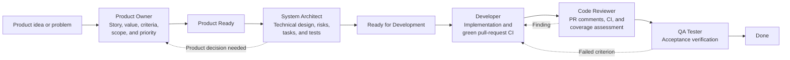

# Product-to-Delivery Workflow

## 1. Purpose

This workflow defines how a ToggleFlow product idea becomes verified software. It
separates product intent, technical design, implementation, independent review, and
acceptance verification without creating unnecessary handoffs for low-risk work.

## 2. Workflow

## 3. Ownership by Ticket Section

| Ticket section | Primary owner | Reviewers |
| --- | --- | --- |
| User story and value | Product Owner | System Architect for feasibility |
| Acceptance criteria | Product Owner | Architect for testability, QA for coverage |
| Exclusions and priority | Product Owner | Architect for technical impact |
| Technical design | System Architect | Developer and Code Reviewer |
| Security and data considerations | System Architect | Code Reviewer and QA Tester |
| Implementation tasks | System Architect proposes | Developer refines and completes |
| Automated tests | Developer | Code Reviewer |
| Pull request and required CI | Developer owns a green build | Code Reviewer verifies current results |
| Test sufficiency | Developer provides coverage | Code Reviewer assesses risk and acceptance coverage |
| Acceptance evidence | QA Tester | Product Owner when behavior is ambiguous |

## 4. Readiness Gates

### Product Ready

- The actor, outcome, and value are explicit.
- Acceptance criteria are observable and limited to one outcome.
- MVP scope and exclusions are clear.
- Product questions that block behavior are resolved.
- The story passes INVEST or declares a true dependency.

### Ready for Development

- Product Ready is satisfied.
- Technical design is adequate for the story's risk.
- Security, data, API, transaction, and migration impacts are addressed.
- Implementation tasks and required tests are identified.
- Architecture references are linked.
- Remaining questions do not block safe implementation.

### Ready for QA

- The implementation is complete against the ticket.
- Every required pull-request CI check passes for the current head commit.
- Developer handoff evidence is present.
- The Code Reviewer has reviewed and commented from the pull request.
- The Code Reviewer has assessed test coverage for the changed behavior and important
  risks, not merely observed a green suite or aggregate percentage.
- Independent review findings are resolved or explicitly accepted, and the updated
  pull-request CI checks pass after fixes.
- The test environment can exercise the intended behavior.

### Done

- Every acceptance criterion is Passed with evidence.
- No unresolved P0 or P1 defect remains.
- Accepted lower-priority risks are visible.
- Documentation matches delivered behavior.
- The ticket's completion does not rely on uncommitted manual database changes.

## 5. Architecture Review Depth

Detailed architecture review is mandatory for authentication, authorization, public
APIs, environment keys, persistence, evaluation, audit transactions, caching,
multi-tenancy, rollout rules, and migrations.

Low-risk content, spacing, or isolated presentation changes may receive a short review
confirming that no architectural boundary changes. The System Architect should not
write speculative designs for routine work.

## 6. Jira Usage

Product-owned content remains in the story description. The System Architect adds a
structured review to the ticket using the format in `.agents/system-architect.md` and
creates implementation Tasks or Subtasks when decomposition helps delivery.

Cross-cutting decisions must also be recorded in repository documentation. Jira alone
is not the permanent architecture record.

Workflow statuses may be added to Jira later. Until then, structured comments and
explicit review outcomes communicate the readiness stage without misusing existing
status transitions.

## 7. Related Instructions

- [Repository Agent Instructions](../AGENTS.md)
- [Product Owner](../.agents/product-owner.md)
- [System Architect](../.agents/system-architect.md)
- [Developer](../.agents/developer.md)
- [Code Reviewer](../.agents/code-reviewer.md)
- [QA Tester](../.agents/qa-tester.md)
- [Engineering and Coding Standards](14-engineering-and-coding-standards.md)
- [Git Branch, Pull Request, and CI Workflow](16-git-branch-pr-ci-workflow.md)

## 8. Project Skills

The repeatable implementation stages are packaged as repository skills:

- `$toggleflow-implement-ticket`
- `$toggleflow-review-change`
- `$toggleflow-verify-ticket`

They live in `.agents/skills` and are scoped to this repository. The Product Owner
continues to use the personal `$write-and-split-user-stories` skill because story
writing and vertical splitting apply across projects.
