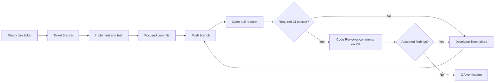

# Git Branch, Pull Request, and CI Workflow

## 1. Purpose

This guide describes how a ToggleFlow Jira ticket moves from a local branch to a
reviewed pull request with passing CI. It applies to contributors and project agents.

The normal path is:



## 2. Before Creating a Branch

Confirm that:

- The Jira ticket belongs to project `TF` and is Ready for Development.
- Required Product Owner and System Architect work is complete.
- You understand the ticket's acceptance criteria and exclusions.
- Existing local changes are understood and will not be overwritten.
- No credentials, `.env` files, build caches, or IDE files will be committed.

Inspect the current repository state:

```bash
git status --short
git branch --show-current
git remote -v
```

Do not switch branches with unresolved work unless that work has been committed or
safely preserved. Never discard another contributor's changes to create a clean
branch.

## 3. Create the Ticket Branch

Start from an up-to-date `main` when the worktree is safe to switch:

```bash
git switch main
git pull --ff-only origin main
git switch -c feature/TF-123-short-description
```

Use this format:

```text
<type>/<Jira-key>-<short-kebab-case-description>
```

### Allowed branch types

| Prefix | Use when the ticket primarily delivers | Example |
| --- | --- | --- |
| `feature/` | New user-visible, domain, or API behavior | `feature/TF-5-boolean-feature-flags` |
| `fix/` | A defect correction | `fix/TF-21-prevent-cross-project-access` |
| `hotfix/` | An urgent production correction | `hotfix/TF-34-revoke-exposed-key` |
| `refactor/` | Internal restructuring with no intended behavior change | `refactor/TF-18-extract-evaluation-action` |
| `docs/` | Documentation-only work | `docs/TF-12-document-api-authentication` |
| `test/` | Test-only additions or corrections | `test/TF-27-cover-key-rotation` |
| `ci/` | CI pipeline or workflow changes | `ci/TF-9-add-frontend-quality-gates` |
| `chore/` | Dependencies, tooling, or repository maintenance | `chore/TF-30-upgrade-pest` |
| `spike/` | Approved, time-boxed technical investigation | `spike/TF-40-evaluate-redis-cache` |

The Jira key is mandatory and uppercase. The description is lowercase, concise, and
kebab-cased. Choose the type from the ticket's primary outcome; a feature branch can
contain its necessary tests and documentation without adding `test` or `docs` to the
name. Contributor and agent names do not belong in branch names.

Do not reuse a merged branch for another ticket.

## 4. Implement and Check Locally

Make the smallest complete change that satisfies the ticket. Add tests alongside the
behavior rather than postponing them until review.

Run the checks relevant to the changed application. The current full local gates are:

```bash
cd apps/platform-api
composer validate --strict
composer test
composer analyse
composer format:test
```

```bash
cd apps/dashboard
pnpm typecheck
pnpm lint
pnpm format:check
pnpm test
pnpm test:e2e
pnpm build
```

The checked-in workflows at `.github/workflows/backend-ci.yml` and
`.github/workflows/frontend-ci.yml` are authoritative if these commands change.

## 5. Review and Commit Local Changes

Inspect exactly what will be committed:

```bash
git status --short
git diff
git diff --check
```

Stage only files belonging to the ticket:

```bash
git add path/to/file path/to/test
git diff --cached
```

### Commit message standard

Use Conventional Commit-style subjects:

```text
<type>[(optional-scope)]: <imperative description>
```

The type is required. The scope is optional and should be included only when it makes
the affected area clearer. Do not invent a vague scope such as `app`, `misc`, or
`changes` merely to fill the parentheses.

| Type | Purpose |
| --- | --- |
| `feat` | New user-visible, domain, or API behavior |
| `fix` | Defect or production correction, including work from a `hotfix/` branch |
| `refactor` | Internal restructuring without an intended behavior change |
| `perf` | Measured performance improvement |
| `test` | Test-only additions or corrections |
| `docs` | Documentation-only changes |
| `ci` | Continuous-integration workflow or configuration changes |
| `build` | Dependency, packaging, or build-system changes |
| `chore` | Repository maintenance not covered by another type |
| `revert` | Reversal of an earlier commit |

Write the description in lowercase imperative form, without a trailing period. Keep
the subject concise—preferably no more than 72 characters—and describe the outcome,
not the activity performed.

Use a body when the reason, trade-off, migration, or non-obvious behavior needs
explanation. Separate it from the subject with a blank line and wrap prose for
readability. Use `BREAKING CHANGE:` in the footer, or `!` after the type or scope, only
for an intentional incompatible change approved by the ticket and API-versioning
rules.

The Jira key is required in the branch name and pull request; it does not need to be
repeated in every commit subject. Keep each commit focused on one coherent outcome.
Do not mix unrelated bulk formatting with behavioral changes.

Valid examples:

```bash
git commit -m "feat: add environment-specific boolean state"
git commit -m "feat(flags): add environment-specific boolean state"
git commit -m "test(flags): cover project and environment isolation"
git commit -m "docs(workflow): document pull-request delivery"
```

Invalid examples:

```text
updated stuff
feature: Added new flags.
fix(misc): changes
TF-5
```

Do not use `git add .` without reviewing the worktree. Do not commit unrelated
formatting, `.env`, plaintext secrets, generated output, or personal IDE state.

## 6. Push the Branch

Publish the branch and configure its upstream:

```bash
git push -u origin feature/TF-123-short-description
```

Subsequent pushes can use:

```bash
git push
```

Do not force-push a shared review branch unless the team explicitly agrees. Prefer
additional focused commits while review is active; history can be squashed during an
approved merge strategy.

## 7. Create the Pull Request

Using GitHub CLI:

```bash
gh pr create \
  --base main \
  --head feature/TF-123-short-description \
  --title "TF-123: Short outcome" \
  --body-file /path/to/pr-description.md
```

Alternatively, open the pushed branch on GitHub and select **Compare & pull request**.

The pull-request description must include:

```markdown
## Jira

TF-123

## Outcome

What user or system outcome this change delivers.

## Changes

- Important implementation change
- Important test or documentation change

## Acceptance criteria

| Criterion | Evidence |
| --- | --- |
| Criterion from Jira | Test, screenshot, or reproducible check |

## Tests

- `command` — Passed

## Risks and follow-up

- Remaining risk, migration note, or `None`
```

Use a draft pull request while implementation is incomplete. Mark it ready only when
the ticket is implemented, local checks pass, and the description contains useful
review evidence.

## 8. Monitor and Fix CI

The Developer owns the pull request's CI result. ToggleFlow runs two independent
GitHub Actions workflows on pull requests:

- **Backend CI** checks Composer validity, MySQL migrations, Pest, PHPStan, and Pint.
- **Frontend CI** checks TypeScript, ESLint, Prettier, Vitest, the Vite production
  build, and Cypress. It installs the Laravel runtime only to support Cypress's
  cross-application browser test; it does not repeat the backend quality suite.

Check CI using GitHub CLI:

```bash
gh pr checks --watch
```

If a check fails:

1. Open the failed job and identify the first meaningful error.
2. Reproduce it locally when possible.
3. Fix the code, test, configuration, or workflow root cause.
4. Do not weaken a test or quality rule solely to obtain a pass.
5. Commit and push the fix.
6. Verify the required checks pass for the new head commit.

CI from an older commit does not qualify. Failing, cancelled, missing, or pending
required checks prevent Code Review approval and QA handoff.

## 9. Code Review on the Pull Request

The Code Reviewer performs the formal review from the pull request and must:

- Confirm the PR matches its Jira ticket and architecture review.
- Inspect the complete diff and surrounding implementation.
- Verify required CI passed for the current head commit.
- Map acceptance criteria and important risks to actual test assertions.
- Check meaningful happy, failure, authorization, isolation, transaction, API, secret,
  accessibility, and UI-state coverage where relevant.
- Emit line-specific actionable findings as Codex inline code-review comments in the
  current task.
- Put cross-cutting observations, CI status, coverage assessment, residual risks, and
  the recommendation in the normal response.

Use one directive per actionable finding:

```text
::code-comment{title="[P1] Short issue title" body="Explanation and recommended fix." file="/absolute/path/File.php" start=268 end=274 priority=1}
```

Use the matching numeric priority from `0` through `3`, an absolute file path, and the
tightest exact line range that demonstrates the issue. These annotations exist only
inside the current Codex task. They do not post to GitHub, modify files, or submit a
GitHub review. Post GitHub feedback only when the user separately requests it.

A green suite or high aggregate coverage percentage does not prove sufficient test
coverage. Reviewers evaluate whether the important behavior can regress without a
test failing.

The reviewer must not approve while required CI is failing, cancelled, missing, or
pending.

## 10. Address Review Findings

The Developer evaluates each finding, fixes accepted findings, and reports the
resolution or evidence in the delivery task. If the finding was also posted to
GitHub, reply on the corresponding PR thread. After changes:

```bash
git add path/to/changed-file path/to/test
git commit -m "fix(flags): enforce environment isolation"
git push
gh pr checks --watch
```

The Code Reviewer then reviews the new diff, confirms the updated CI run, and reports
whether each Codex inline finding is resolved or remains actionable. If a finding was
also posted to GitHub, keep that PR discussion open until it is substantively
resolved.

## 11. Ready for QA and Merge

A pull request is Ready for QA only when:

- Every acceptance criterion is implemented.
- All required CI checks pass for the current head commit.
- The Code Reviewer reviewed the actual pull request and recorded actionable findings
  as Codex inline comments in the delivery task.
- Accepted findings are fixed or explicitly accepted as visible risk.
- Test coverage is adequate for the changed behavior and important risks.
- Documentation matches the implementation.

Merge only after the required approvals and QA evidence exist. Use the repository's
configured merge strategy. Do not merge merely because GitHub enables the button.

After merge, update local `main` and remove the local ticket branch when it is no
longer needed:

```bash
git switch main
git pull --ff-only origin main
git branch -d feature/TF-123-short-description
```

Deleting the remote branch through GitHub after merge is appropriate. Never use
forced deletion to hide an unmerged or uncertain change.

## 12. Useful Commands

```bash
gh pr view --web             # Open the current PR
gh pr view --comments        # Read PR discussion
gh pr diff                   # Inspect the PR diff
gh pr checks                 # Show CI results
gh pr checks --watch         # Wait for CI updates
git log --oneline main..HEAD # Show commits unique to the branch
git diff main...HEAD         # Show the complete branch diff
```

## 13. Related Documentation

- [Product-to-Delivery Workflow](13-product-to-delivery-workflow.md)
- [Engineering and Coding Standards](14-engineering-and-coding-standards.md)
- [Monorepo Application Structure](15-monorepo-application-structure.md)
- [Developer Role](../.agents/developer.md)
- [Code Reviewer Role](../.agents/code-reviewer.md)
