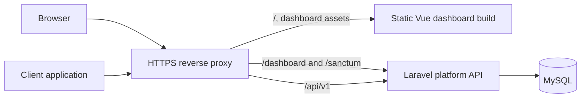

# Monorepo Application Structure

## 1. Status

Accepted and implemented for the application foundation.

## 2. Decision

ToggleFlow remains one Git repository containing two independently built
applications:

```text
toggleflow/
├── apps/
│   ├── platform-api/       # Laravel control plane and versioned evaluation API
│   └── dashboard/          # Vue 3, TypeScript, Vite, and Tailwind SPA
├── packages/               # Future shared contracts and SDK packages when needed
├── docs/
├── .agents/
├── .github/
├── AGENTS.md
└── README.md
```

`packages/` is a reserved convention, not a requirement to create empty packages.
Likely future packages include generated API types or published SDKs, but each must
have a real consumer and an approved ticket.

## 3. Application Responsibilities

### `apps/platform-api`

The Laravel application owns:

- Dashboard session authentication through Sanctum
- Management APIs and authorization policies
- Projects, environments, flags, environment state, credentials, and audit history
- The versioned `/api/v1` evaluation API
- MySQL persistence, transactions, validation, rate limiting, and secret handling

It remains a modular monolith. Management and evaluation have separate controllers,
middleware, response contracts, and performance concerns, but reuse application and
domain services where appropriate.

### `apps/dashboard`

The Vue SPA owns:

- Client-side routing and the authenticated application shell
- Management workflows, forms, accessible confirmation dialogs, and status feedback
- Typed calls to Laravel management endpoints
- Tailwind design tokens, reusable UI primitives, and domain components

It contains no authoritative authorization or feature-evaluation rules.

Its product source is ownership-oriented:

```text
apps/dashboard/src/
├── app/       # bootstrap, shell, router, providers, styles, composition
├── features/  # authentication, projects, feature-flags, credentials, audit-history, dashboard
├── shared/    # domain-neutral API transport, navigation safety, and UI primitives
└── env.d.ts   # Vite declaration
```

Do not recreate layer-first product folders at `src/pages`, `src/services`,
`src/stores`, `src/types`, or similar paths. Cross-feature consumers import the
owner's public `index.ts`; the lint gate enforces dependency direction and cycles.

## 4. Why a Monorepo

- Product, API, UI, tests, documentation, and SDK evolution remain versioned together.
- A vertical feature can update its Laravel endpoint and Vue workflow in one change.
- Shared CI and repository standards reduce coordination cost as the product evolves.
- The applications keep distinct dependency manifests and build processes without the
  operational overhead of multiple repositories.

A monorepo does not require one runtime process or one release artifact. It defines
source ownership and coordinated change, not deployment topology.

## 5. Local Development

Docker is deliberately deferred. The intended local workflow is:

```text
Terminal 1: apps/platform-api  → php artisan serve
Terminal 2: apps/dashboard     → pnpm dev
Local MySQL                    → authoritative database
```

The dashboard and API may use different local origins. The Laravel configuration
must explicitly include the dashboard host and port in Sanctum's stateful domains and
credentialed CORS allowlist. The Vue HTTP client must send cookies and CSRF headers.

Redis is not required for local or evaluation correctness. Docker Compose may be
added through the production-operations roadmap; it must not become the only
supported local workflow without an approved documentation change.

## 6. Production Topology

The preferred self-hosted topology presents one public HTTPS origin:



One origin simplifies secure cookies, CSRF protection, CORS, and installation. The
dashboard can be served by the reverse proxy as static assets; Laravel does not need
to own the SPA source or Vite build.

The Identity and ReleaseManagement module providers register their module-owned route
files beneath `/dashboard/*`. The Evaluation module provider registers its route file
beneath `/api/v1/*`. The Vue application uses `/app` rather than `/dashboard` for its
protected landing page so same-origin proxy routing remains unambiguous.

## 7. Why There Is No `apps/evaluation-api` Yet

The evaluation path is security- and performance-sensitive, but a directory boundary
does not create scalability. Extracting it now would add service authentication,
network failure modes, duplicated deployment configuration, data ownership questions,
and distributed observability without measured traffic or availability evidence.

Consider extraction only when evidence shows one or more of these needs:

- Evaluation must scale or deploy independently from management traffic.
- Evaluation availability requires a different failure domain.
- A cache or replicated read model becomes authoritative enough to need separate
  operational ownership.
- Release cadence or security controls materially differ between the paths.

Before extraction, define API compatibility, database ownership, cache invalidation,
credential verification, audit boundaries, and failure behavior in a new architecture
decision. The public `/api/v1` contract must remain stable for clients.

## 8. Structural Change Rules

Future structural changes are architecture changes, not opportunities for an
unrelated product rewrite.

1. Keep Laravel-owned files and PHP tooling in `apps/platform-api`.
2. Keep Vue source and frontend tooling in `apps/dashboard`.
3. Add root workspace commands only where they make common checks easier.
4. Update CI, environment examples, ignore rules, and documentation in the same
   change.
5. Preserve management and evaluation routes, response contracts, tests, and Sanctum
   behavior.
6. Verify both applications independently and verify the browser-to-API login flow.

Do not combine structural changes with microservice extraction, Passport adoption,
rule-engine work, or Docker packaging.

## 9. Consequences

### Benefits

- Clear frontend and backend ownership
- Independent dependency upgrades and builds
- A direct path to future SDK packages
- Continued atomic product changes within one repository
- Freedom to change deployment topology later without reorganizing source ownership

### Costs

- Two development servers and two application-level dependency installations
- Explicit local CORS and Sanctum stateful-domain configuration
- CI must run checks in both workspaces
- CI and local tooling must account for both application workspaces

## 10. Related Documentation

- [Domain and Architecture](../architecture/overview.md)
- [Architecture and Flow Diagrams](../architecture/system-diagrams.md)
- [Authentication and API Key Decision](../architecture/authentication-and-api-keys.md)
- [Frontend Architecture and Design System](../architecture/frontend-architecture.md)
- [Engineering and Coding Standards](coding-standards.md)
